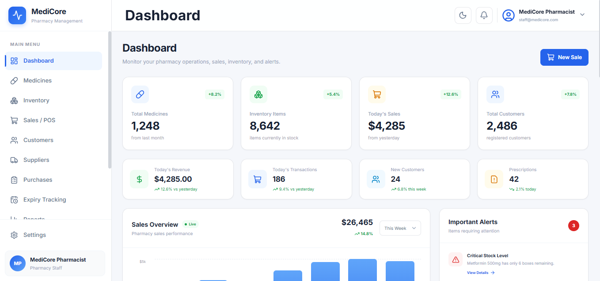
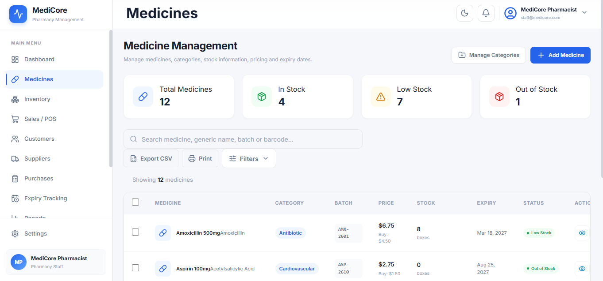
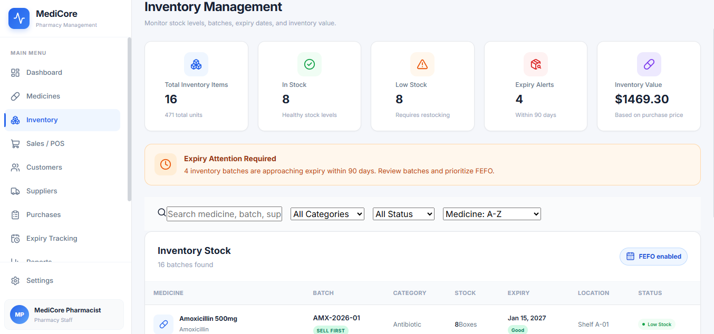
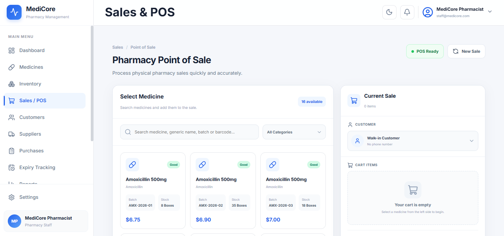
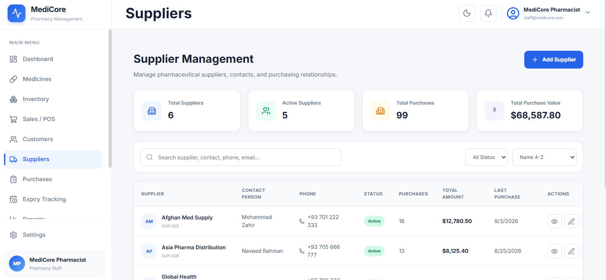
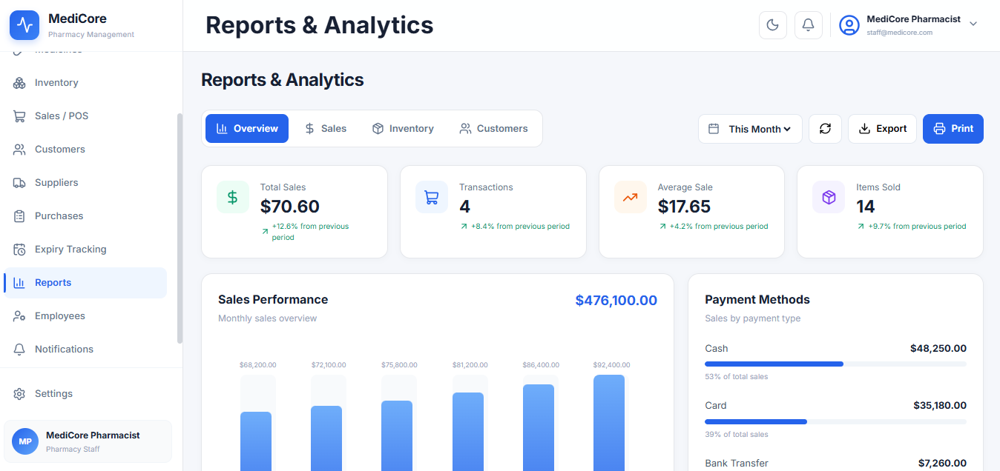

## 📸 Screenshots














# 💊 MediCore Pharmacy Management System

A professional Pharmacy Management System built with **React.js** for managing daily pharmacy operations.

## ✨ Features

- 📊 Dashboard
- 💊 Medicine Management
- 📦 Inventory Management
- 🧾 Sales / POS
- 👥 Customer Management
- 🚚 Supplier Management
- 🛒 Purchase Management
- ⏰ Expiry Tracking
- 🔔 Notifications
- 📈 Reports & Analytics
- 👨‍💼 Employee Management
- ⚙️ Settings
- 🔐 Login System
- 🌙 Dark Mode
- 📱 Responsive Design

## 🛠️ Technologies

- React.js
- JavaScript
- Vite
- React Router
- Lucide React
- CSS3
- Local Storage

## 🚀 Run the Project

```bash
npm install
npm run dev